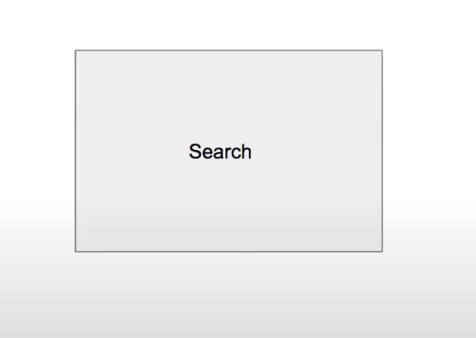

# Step 1: 
## a. Collect functional requirement
- Detailed problem statement
- Very English, do at High level
- spend a few minutes to show that you can communicate given an unknown problem
- ask questions to clarifies all the doubts
- It will hurt you later if not collected properly
## b. Collect design constraints
- Numbers, how many, how much?
- Required for answering scalability
- Can be collected at later stage as well
Note: All standard stats should be known. Following are few stats.
- What is search per second on Google? 40,000 per seconds
- Number of users for Facebook? 
- Number of users for YouTube? 
# Step 2:
## a. Bucketize functional requirements into micro services
- Simple high level clustering of requirements
- Imaging if all requirements can be handled by same team or not
- One approach: If data models and API to address two requirements do not look same, then put them in separate bucket

## b. Get clarity weather problem is breadth-oriented or depth-oriented
- Depth oriented problem means needs to go depth to solve given problem (Document search).
- Breadth oriented means to discuss more and more building blocks (Neflix or Uber)

# Step 3:
## a. Draw a logical diagram
- Each system start out as a single machine
- Solve for single server system (as if solving in Leetcode/HackerRank which act as a single machine)

## b. Draw and explain data/logic flow between them
- If high volume of data needs to be pushed in near realtime between two micro services, use publisher subscriber.
- Pub/Sub is a micro service of it's own
- If data needs to be pulled from server from client; use REST API
- If data transfer is offline; you may use batches ETL(Extract Transformation Load) jobs

# Step 4:
## a. Deep dive on each micro services at a time
- Solve each tier logically
- Scale is not in picture yet
- Identify data model(what data needs to be stored) to match the functional requirements
- Discuss how data will be stored in storage and cache tiers
- Propose API to match the functional requirements
- Propose workflow/algorithm for the APIs in each tier
- Propose flow across tiers within the micro service
    - This is phase 1 per micro service
    - Changes from problem to problem
    - This is the most thinking portion of interview

Note: If too many micro services
- Negotiate with interviewer on which one to focus on
- Depending on number of micro services to focus on; budget your time

## b. Each micro services consists of one of more tiers
Following are possible tiers
- App Server tier - to handle application tier
- Cache server tier - for high throughput data access
- Storage server tier - for data persistence 

- Check weather each tier needs to scale
- A deterministic set of reasons can be posted across all interviews
    - Need to scale for storage (storage and cache tier)
    - Need to scale for throughput (CPU/IO)
    - Need to scale for API parallelism 
    - Need to remove hotspots
    - Availability and Geo distributions
- The constraints or numbers change from problem to problem
- Solve algebraiclly (formula based) first and then put numbers
    - Algebraic solution is same for all problem
- If it is taking time then do not spend time on calculations/estimates here unless asked for and get out fast.

## c. Build scalable system
This is generic approach. Distributed system design is available in last 30 years.
- For each micro services
    - If tier needs scale, scale the tier and propose the distributed system
- This is most deterministic portion of soln
    - Draw a generic distributed architecture per tier
    - If app server tier are stateless then just round robin the request
    - If cache or storage tier
        - Partition the data into shards or bucket to suite the requirements of scale
        - Propose the algorithm to place the shards on server (consistent hashing)
        - Explain how API work 
        - Propose replication
        - Propose CP or AP (algo for CAP doesn't change from problem to problem)
- This is how each micro services looks within a single data center, either on premise or VPC in cloud
Note: Sharding is a stone which hits lot of words :-)
Replication helps on availability
- Draw architecture for every layer

